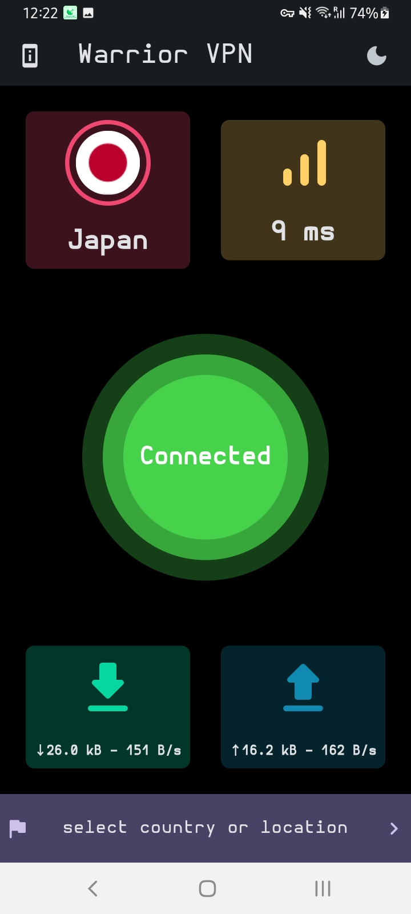
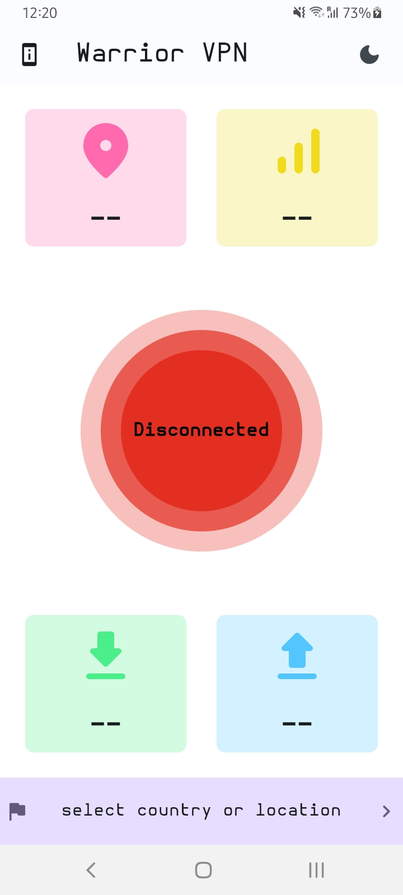
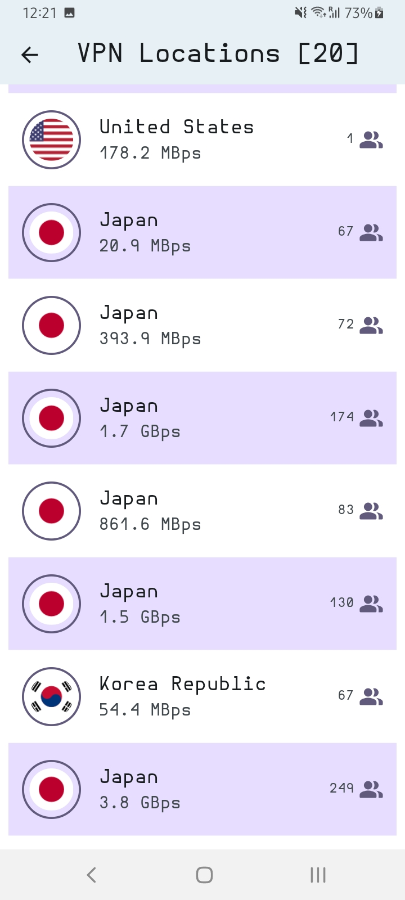

## This is **Warrior VPN** app made with Flutter

- It has more than 90 addresses to choose from.
- Comes with a light and dark theme.
- It has intuitive and colorful design.
- Fully applicable and work seamlessly.

 

## Libraries and Packages used:
1- <a href="https://pub.dev/packages/csv">csv: 5.1.0</a>

2- <a href="https://pub.dev/packages/flutter_svg">flutter_svg: 2.0.8</a>

3- <a href="https://pub.dev/packages/get">get: 4.6.6</a>

4- <a href="https://pub.dev/packages/hive">hive: 2.2.3</a>

5- <a href="https://pub.dev/packages/hive_flutter">hive_flutter: 1.1.0</a>

6- <a href="https://pub.dev/packages/http">http: 1.1.0</a>

7- <a href="https://pub.dev/packages/path_provider">path_provider: 2.1.1</a>

8- <a href="https://pub.dev/packages/shimmer">shimmer: 3.0.0</a>

## Dev Dependencies used:

9- <a href="https://pub.dev/packages/build_runner">build_runner: 2.4.6</a>

10- <a href="https://pub.dev/packages/hive_generator">hive_generator: 2.0.1</a>

11- <a href="https://pub.dev/packages/flutter_launcher_icons">flutter_launcher_icons: 0.13.1</a>

 

## App Screenshots

| Connected | Disconnected | List |
| :-: | :-: | :-: |
 |  |  |

 
